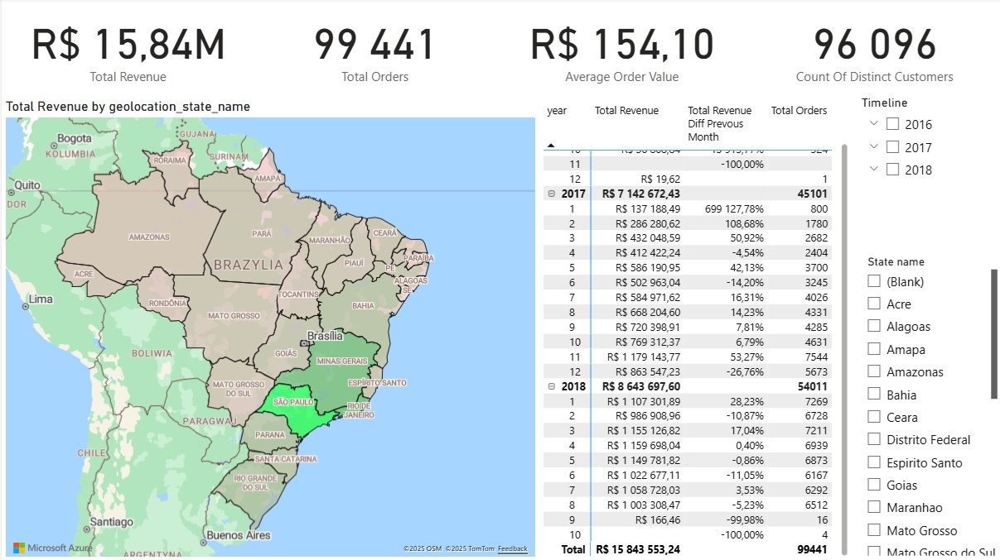
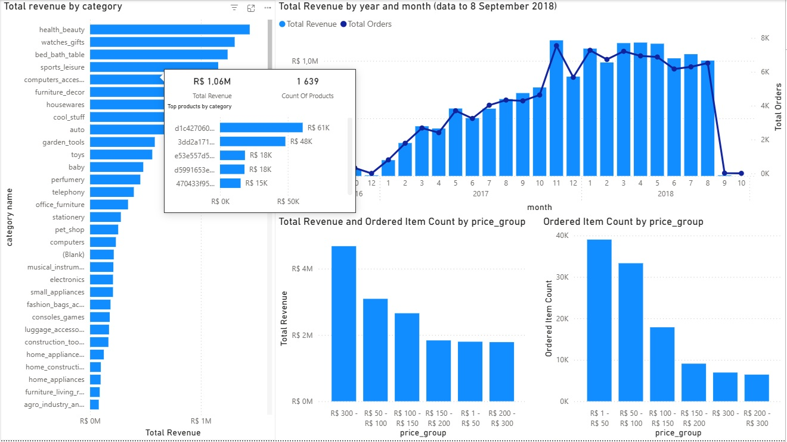
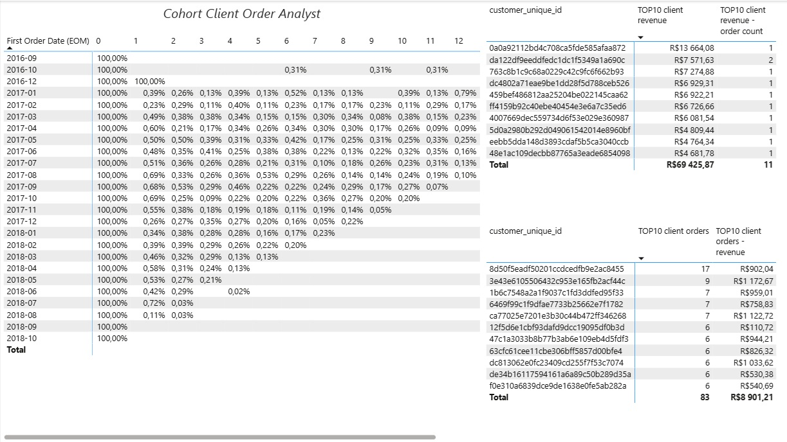

# Strategic Analysis of E-commerce Performance for TechElectro

## Project Overview

This project presents a comprehensive business intelligence solution for **TechElectro**, a fictional but realistic e-commerce company. The goal was to move beyond simple reporting and conduct a deep-dive analysis to diagnose critical business challenges related to profitability, customer loyalty, and sales performance.

The final output is a multi-page, interactive dashboard built in **Power BI**, designed to provide actionable insights for executive-level decision-making.

## Key Business Questions Addressed

1.  **Sales Performance:** What are the overall sales trends, and is the company's growth sustainable?
2.  **Product & Category Analysis:** Which product categories are the primary revenue drivers versus those that drive volume? Where are the profitability gaps?
3.  **Customer Behavior:** What is the real state of customer loyalty? Are we acquiring new customers effectively, or are we operating a "leaky bucket" business model?
4.  **Geographic Insights:** Where are our key markets, and how does performance vary by region?

## The Analytical Process

1.  **Data Modeling:** All raw `.csv` files were loaded into Power BI. A robust and efficient **star schema** data model was built from the ground up to ensure data integrity and optimal query performance. This is the foundational core of the entire analysis.
2.  **DAX for Advanced Metrics:** Key Performance Indicators (KPIs) were implemented using custom DAX measures, moving beyond default aggregations. This included `Total Revenue`, `Total Orders`, `Average Order Value`, and `YoY Growth` calculations.
3.  **Advanced Analysis - Cohort Analysis:** To measure customer loyalty, a full cohort analysis was implemented. This provided a clear, month-over-month view of customer retention rates, revealing critical insights into long-term customer value.
4.  **Data Storytelling & Visualization:** The dashboard was designed with a clear narrative. It guides the user from a high-level executive summary to deep-dive analyses of products and customers, using clear, uncluttered visualizations and interactive tooltips for progressive disclosure of information.

## Key Findings & Insights

*   **Critically Low Customer Retention:** The cohort analysis revealed an alarmingly low retention rate, with less than 1% of customers returning for a second purchase after the first month. This indicates a business model heavily reliant on constant, costly customer acquisition.
*   **Revenue vs. Volume Dichotomy:** The analysis showed that high-revenue product categories are not the same as high-volume categories. While a few expensive items drive revenue, the bulk of orders comes from a long tail of cheap products, indicating a potential mismatch in marketing and inventory strategy.
*   **Geographic Concentration:** Sales are heavily concentrated in the southeastern states, particularly São Paulo, presenting both an opportunity for deeper market penetration and a risk of over-reliance on a single region.

## SCRIPT OVERVIEW

# This script serves as a lightweight ETL (Extract, Transform, Load) tool to set up the project's database.
Its primary responsibilities are:
1. Environment Configuration:** Loads the database connection string securely from a `.env` file to keep credentials out of the source code.
2. Schema Definition:** Uses a dictionary of SQL DDL commands to define the structure for all necessary tables.
3. Automated Table Creation:** Iterates through the defined tables and executes `CREATE TABLE IF NOT EXISTS` commands, making the script safe to run multiple times.
4. Data Ingestion:** For each table, it locates the corresponding `.csv` file, skips the header, and uses the efficient `copy_from` method of `psycopg2` to bulk-insert the data.
5. Error Handling:** Includes basic error handling for database connection issues and missing source files.

## Tools & Technologies

*   **Primary Tool:** Microsoft Power BI
*   **Analysis & Formulas:** DAX (Data Analysis Expressions)
*   **Data Preparation:** Power Query
*   **(Optional) Data Staging:** Python (with `psycopg2`) and PostgreSQL were used to build an initial database schema and automate the ETL process, demonstrating skills beyond the BI tool itself.

## How to Use This Repository

1.  Find the final `dashboard.pbix` file.
2.  Open the file in Power BI Desktop to interact with the full dashboard.
3.  The `Data` folder contains the original raw `.csv` files.
4.  The `Scripts` folder contains the optional Python script for database population.

